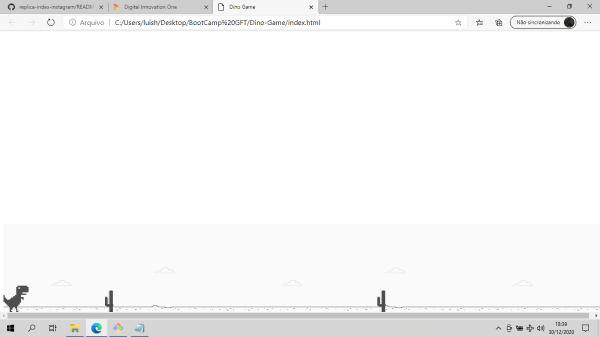
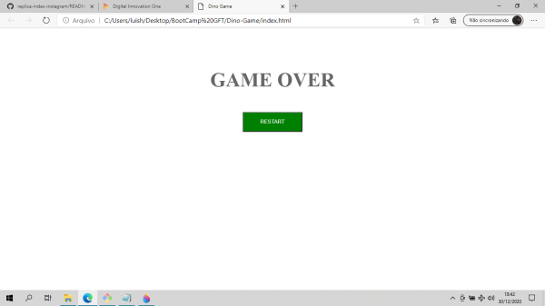

#  DINO-GAME Réplica do Game do Google Chrome<a name="sobre">
### Projeto do bootcamp 🚀 GFT START_UNI 2021 #1

Tabela de conteúdos
=================
<!--ts-->
   * [Sobre](#Sobre)
   * [Tabela de Conteúdo](#tabela-de-conteudo)
   * [Status do Projeto](#status)
   * [Demostracão da Aplicação](#demostracao)
   * [Como jogar(#como-jogar)
      * [Pré Requisitos](#pre-requisitos)
   * [Tecnologias](#tecnologias)
   * [Autor](#autor)
<!--te-->

## Status do Projeto <a name="status">
<h4> 
  🚧 Game Concluído 🚀 Possíveis melhorias futuras(ex: pontuação) 🚧
</h4>

## ✅ Demonstração da aplicação <a name="demostracao"> 

### Jogando
<h1>
  
</h1>

### Game Over
<h1>
  
</h1>

## ✅ Como Jogar? <a name="como-jogar"> 
### Clone este repositório
git clone https://github.com/HenriqueCaldas/Dino-Game.git/
   
acesse a pasta do repositório
   
Abra o arquivo index.html no seu navegador web

## ✅ Pré-requisitos <a name="pre-requisitos">
Ter instalado na sua máquina um navegador web

## ✅ <a name="tecnologias"> Tecnologias utilizadas
- JavaScript
- HTML 5
- CSS 3

## ✅ Autor <a name="autor">  
Luis Henrique Caldas
   
(81) 99531-4763
   
[Linkedin](https://www.linkedin.com/in/henriquecaldas/)
